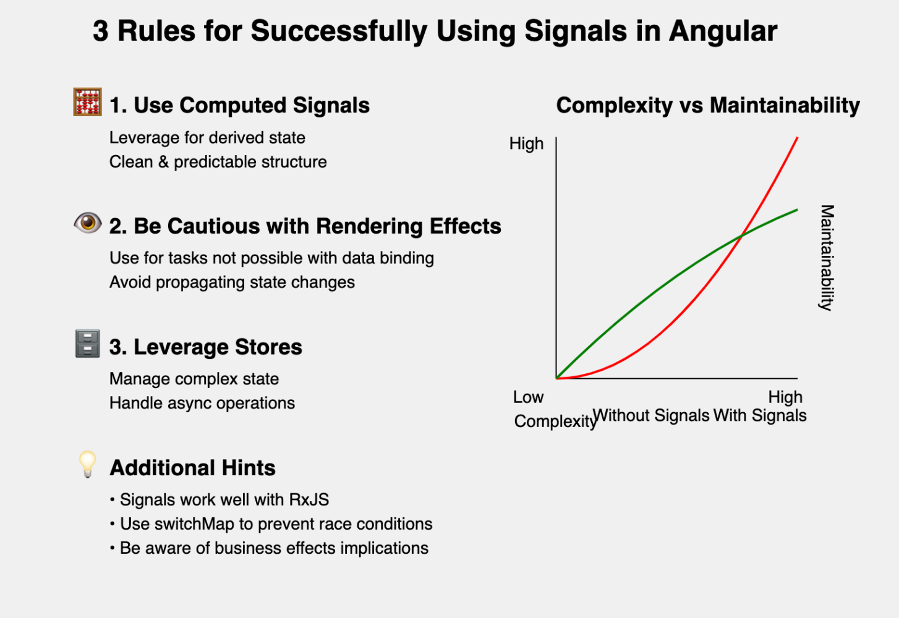

# ✅ Rules for Successfully Using Signals in Angular

In the recent talk titled ["3 Rules for Successfully Using Signals in Angular"](https://www.youtube.com/watch?v=Q5Kdo9jYiWA), by [Manfred Steyer](https://www.linkedin.com/in/manfred-steyer-84645821/), key strategies and principles were shared for making the most out of Angular's signal-based reactivity model. Here are the essential takeaways:

## 1. Use Computed Signals for Derived State

- Computed signals are underrated but powerful.
- They automatically recalculate when dependencies change.
- Help maintain a clean and predictable state structure.

## 2. Be Cautious with Rendering Effects

- Use rendering effects for tasks that can't be done with data binding.
- Examples: logging to console, displaying toast messages, or canvas painting.
- Avoid using rendering effects to propagate state changes.

## 3. Leverage Stores for Managing Complex State

- Stores enforce unidirectional data flow.
- They help manage asynchronous operations and state updates.
- Make reactive flows more manageable and maintainable.

### Additional Hints

- Signals work well with RxJS for advanced reactive programming.
- Use RxJS operators like `switchMap` to prevent race conditions.
- Be aware of the implications when using business effects with signals.

### Business Effects Considerations

- Effects may miss intermediate values due to the "glitch-free" property of signals.
- Be cautious of circular dependencies and infinite loops.
- Consider alternatives like explicit effects or reactive methods in stores.

## Conclusion

By following these rules and considerations, developers can effectively use signals in Angular to create more maintainable and predictable applications. Signals offer a powerful way to manage state and reactivity, but they require thoughtful implementation to maximize their benefits.

---

Check out the full talk here: [3 Rules for Successfully Using Signals in Angular](https://www.youtube.com/watch?v=Q5Kdo9jYiWA).
